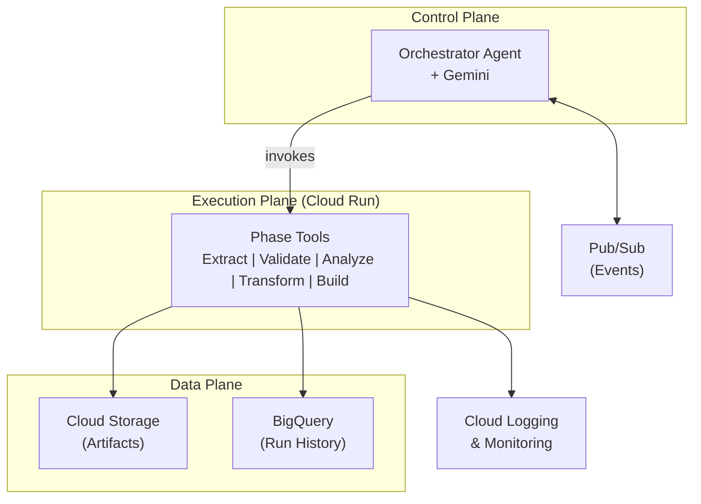
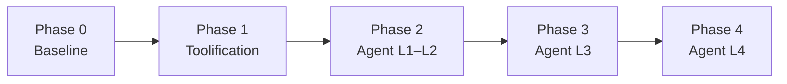

# Agentic Orchestrator Whitepaper

## Google ADK + GCP Baseline — Single-Agent Design

**Version 1.0 | December 2024**

---

# 1. Executive Summary

## Scope and Intent

This document is a **high-level architectural approach whitepaper**. It describes how an existing pipeline orchestrator can be reframed as a single-agent agentic system using Google Cloud Platform (GCP), the Agent Development Kit (ADK), and Gemini. This whitepaper does not define implementation details, deployment configurations, or low-level schemas. The intent is to provide strategic framing for decision-makers evaluating agentic modernization.

## The Current State

The Pipeline Orchestrator is a production-grade framework that manages complex multi-phase data processing pipelines. It operates on a five-phase execution model—**Extract → Validate → Analyze → Transform → Build**—running as a deterministic, sequential automation system with logging, metrics, and selective artifact management.

The system handles enterprise-scale workloads and provides observability through timestamped logs and success-rate calculations. A central orchestrator class controls the flow, executing phase scripts, validating outcomes, and propagating state.

## The Limitation of Static Orchestration

The current implementation operates on **static decision paths**. If a phase fails, execution halts. There is no adaptive reasoning—no ability to analyze failure patterns, adjust strategies dynamically, or learn from historical runs.

This rigidity introduces friction:

- **Manual intervention** required when phases fail for recoverable reasons
- **No contextual awareness** of why failures occur or how to remediate
- **Static thresholds** that cannot adapt to changing data characteristics
- **Historical patterns** not leveraged for proactive optimization

## The Agentic Evolution

Transforming from static orchestration to a **single-agent agentic system** changes the operational model:

| Static Pipeline | Agentic Orchestrator |
|-----------------|---------------------|
| Predefined execution paths | Reasoning-driven phase selection |
| Fail-fast on any error | Context-aware retry and recovery |
| Manual threshold configuration | Self-tuning based on historical metrics |
| Logs as passive records | Logs as active context for decisions |
| Human-initiated re-runs | Agent-initiated remediation |

The proposed architecture introduces **one Orchestrator Agent** powered by Gemini, operating within Google's ADK framework on GCP. This agent treats each pipeline phase as a **callable tool**, using a **Think → Act → Observe** loop to drive intelligent execution.

## Strategic Capability Levels

The single Orchestrator Agent evolves through four capability levels:

1. **Level 1 — Connected Problem Solver**: Calls tools deterministically with basic flexibility
2. **Level 2 — Strategic Problem Solver**: Plans multi-step flows, adapts based on outcomes
3. **Level 3 — Collaborative Orchestrator**: Coordinates complex workflows with approval gates
4. **Level 4 — Self-Evolving System**: Proposes improvements to its own playbooks

## Key Business Outcomes

- **Reduced Manual Intervention**: Material reduction in human touchpoints for failure recovery
- **Faster Cycle Times**: Intelligent retry and adaptive planning reduce end-to-end duration
- **Improved Reliability**: Context-aware error handling increases first-pass success rates
- **Enhanced Auditability**: Every decision logged with reasoning chain
- **Higher Throughput**: Self-optimization maximizes artifact processing

---

# 2. Current System Overview

## Architecture Summary

The orchestrator is implemented as a central control module that manages the end-to-end pipeline. It maintains state for each run, tracks which phases have completed, and logs all execution outcomes.

The system supports multiple execution modes—analysis only, transform and build, or full pipeline—allowing users to select the appropriate workflow for their needs.

## Pipeline Phases

The orchestrator executes five sequential phases:

- **Extract**: Obtains raw source files, configurations, data files, and metadata from delivery snapshots
- **Validate**: Cleans and validates extracted files for integrity, checking encoding, syntax, and completeness
- **Analyze**: Analyzes dependencies, patterns, metrics, and quality across the extracted content
- **Transform**: Converts source files to target formats according to defined transformation rules
- **Build**: Compiles and packages validated artifacts, calculating final success metrics

## Current Behavior

Each phase invokes underlying tool scripts, captures logs, and returns success or failure status. If any phase fails, the pipeline halts—a fail-fast model that ensures no downstream work proceeds on bad inputs but requires manual re-runs for recoverable errors.

The orchestrator calculates and reports success rates (transformation success rate, build success rate) at the end of each run, providing visibility into pipeline health.

**Figure: Current Orchestrator Architecture**
A central orchestrator module controls five sequential phases (Extract → Validate → Analyze → Transform → Build), invoking tool scripts for each phase and capturing logs and metrics throughout execution.

---

# 3. Google's Agent Model Applied to the Orchestrator

## The Agent Equation

Google's agent model defines an agent as:

**Agent = Model + Tools + Orchestration**

Applied to the Pipeline Orchestrator:

| Component | Role |
|-----------|------|
| **Model** | Gemini serves as the reasoning engine |
| **Tools** | Pipeline phases exposed as callable tools |
| **Orchestration** | Think → Act → Observe loop controlling execution |

This is a **single-agent architecture**. One Orchestrator Agent reasons about the pipeline and invokes multiple tools (phases). There are no separate Extract Agent, Validation Agent, etc.

## The Think → Act → Observe Loop

The agent operates in a continuous loop:

- **Think**: Analyze current state, logs, and metrics; decide which phase or action to take next
- **Act**: Invoke the selected tool (phase) with appropriate parameters
- **Observe**: Read tool outputs, update internal state, log the decision and outcome

This loop continues until the pipeline completes, encounters a fatal error, or requires human approval.

## Capability Levels

The Orchestrator Agent matures through four levels:

**Level 1 — Connected Problem Solver**
The agent calls tools in sequence, following established flow. It interprets results and reports status but does not adapt behavior.

**Level 2 — Strategic Problem Solver**
The agent plans multi-step flows based on current state. It adapts based on intermediate outcomes and implements intelligent retry logic when failures occur.

**Level 3 — Collaborative Orchestrator**
The agent coordinates complex workflows, manages human-in-the-loop approval gates, and handles cross-pipeline dependencies. It can pause execution and await external signals.

**Level 4 — Self-Evolving System**
The agent analyzes historical patterns across many runs, proposes threshold adjustments and configuration changes, and can modify its own playbooks with human approval.

---

# 4. Transforming the Orchestrator Into a Single-Agent System

## Phases as Tools

Each existing pipeline phase becomes a callable tool that the Orchestrator Agent can invoke. The agent decides which tool to call, passes the necessary context, and interprets the results.

The core phase tools are:

- **Extract Tool**: Retrieves source files from delivery snapshots
- **Validate Tool**: Checks integrity of extracted files
- **Analyze Tool**: Performs dependency, pattern, and quality analysis
- **Transform Tool**: Converts files to target formats
- **Build Tool**: Compiles and packages artifacts

Additional utility tools support the agent's reasoning—reading logs, calculating metrics, sending notifications, and querying historical data.

## Context Engineering

The agent maintains two layers of context:

**Short-Term Context** captures the current run: which phases have completed, current phase status, artifacts processed, errors encountered, and retry counts. This context informs immediate decisions within a single pipeline execution.

**Long-Term Context** aggregates information across runs: historical success rates, common failure patterns, effective recovery strategies, and performance trends. This context enables the agent to learn from past behavior and make better decisions over time.

## Guardrails and Human-in-the-Loop

The agent operates within defined guardrails:

- **Success Thresholds**: The agent halts and escalates if success rates fall below acceptable levels
- **Retry Limits**: Maximum retry attempts prevent infinite loops on persistent failures
- **Approval Gates**: Human approval is required before proceeding when outcomes fall outside expected ranges
- **Timeouts**: Phase execution is bounded to prevent runaway processes

These guardrails ensure the agent behaves predictably and defers to humans when appropriate.

---

# 5. Proposed GCP Reference Architecture

## Architecture Overview

The target architecture places a single Orchestrator Agent on GCP, using ADK as the agent framework and Gemini as the reasoning engine. Pipeline phases are exposed as containerized services that the agent invokes as tools.

**Key Components:**

- **ADK Application**: Hosts the Orchestrator Agent and manages the Think → Act → Observe loop
- **Gemini**: Provides reasoning capabilities for planning and decision-making
- **Tool Services**: Each pipeline phase runs as an isolated, containerized service
- **Run History Store**: Maintains records of past executions for long-term context
- **Artifact Storage**: Holds source files, intermediate work products, and final outputs
- **Event System**: Triggers runs, handles notifications, and manages approval workflows
- **Observability Layer**: Captures logs, metrics, and traces for monitoring and debugging

## GCP Services Mapping

| Component | GCP Service |
|-----------|-------------|
| Agent Runtime | ADK on Cloud Run |
| Reasoning Engine | Gemini via Vertex AI |
| Tool Execution | Cloud Run (containerized services) |
| Short-term Context | Firestore or in-memory |
| Long-term Memory | BigQuery |
| Artifact Storage | Cloud Storage |
| Event Triggers | Pub/Sub |
| Observability | Cloud Logging and Monitoring |

**Figure: Single-Agent Orchestrator on GCP**

The architecture consists of three planes: a Control Plane (ADK application with Orchestrator Agent and Gemini), an Execution Plane (Cloud Run services for each phase tool), and a Data Plane (Cloud Storage for artifacts, BigQuery for run history). Pub/Sub and Cloud Logging provide event coordination and observability.

---

# 6. Capability Levels in Practice

## Level 1: Connected Problem Solver

At this level, the agent executes the pipeline by invoking tools in sequence. It interprets exit codes and logs to determine success or failure, provides basic reporting after each phase, but does not adapt its behavior based on outcomes.

This level essentially replicates current orchestrator behavior with agent-based execution, establishing the foundation for more advanced capabilities.

## Level 2: Strategic Problem Solver

The agent begins to adapt. It adjusts next steps based on current results, implements intelligent retry with modified parameters when failures occur, and can conditionally skip phases if prerequisites indicate issues.

For example, if validation fails due to an encoding error, the agent recognizes the pattern and retries with encoding detection enabled, rather than simply failing the run.

## Level 3: Collaborative Orchestrator

The agent coordinates with humans and external systems. It pauses for approval when success rates fall below thresholds, triggers downstream systems on completion, waits for prerequisite pipelines, and routes different error types to appropriate responders.

This level introduces human-in-the-loop workflows where the agent defers decisions that require judgment beyond its capabilities.

## Level 4: Self-Evolving System

The agent analyzes patterns across many runs to identify recurring issues. It proposes threshold adjustments, suggests new retry strategies, and can generate modifications to its own playbook—always with human approval before changes take effect.

This level enables continuous improvement of the orchestration process itself, not just individual runs.

---

# 7. Single-Agent Design Principles

## One Agent, Many Tools

The design centers on a single Orchestrator Agent with access to a registry of tools. The agent is the only decision-maker; tools are functions it invokes to take action in the environment.

This contrasts with multi-agent architectures where different agents might handle different phases. The single-agent approach provides unified context, simpler coordination, and clearer accountability.

## Tool Selection

The agent selects tools based on:

- **Current State**: Which phases have completed, which are pending
- **Last Result**: Success, failure, and specific outputs from the previous tool
- **Error Context**: Type and severity of any failures encountered
- **Historical Patterns**: What has worked in similar situations
- **Guardrails**: Approval requirements and retry limits

## Error Classification and Response

The agent classifies errors and responds accordingly:

- **Transient errors** (timeouts, network issues): Automatic retry with backoff
- **Recoverable errors** (encoding, input format): Retry with modified parameters
- **Quality errors** (low success rates): Pause for human approval
- **Fatal errors** (missing dependencies): Abort with notification

This classification enables appropriate responses without requiring human intervention for routine issues.

**Figure: Orchestrator Agent and Tooling Layer**
The Orchestrator Agent (powered by Gemini) operates a Think → Act → Observe loop, selecting from a registry of phase tools (Extract, Validate, Analyze, Transform, Build) and utility tools (logging, metrics, notifications). Tool execution occurs in isolated Cloud Run services.

---

# 8. Implementation Roadmap

The evolution from current state to full agentic orchestration proceeds through five phases over approximately 8–12 months.

## Phase 0: As-Is Baseline (4 weeks)

**Focus**: Document the current architecture, establish observability baseline, and define success metrics.

**Outcomes**: Clear understanding of existing behavior, instrumented logging and metrics, baseline success rates established.

**GCP Integration**: Initial Cloud Logging and BigQuery integration for historical data.

## Phase 1: Toolification (6 weeks)

**Focus**: Wrap pipeline phases as callable tools compatible with ADK, containerize tool scripts, and define tool interfaces.

**Outcomes**: All five phases callable as standalone tools, services deployed to Cloud Run, tool registry configured.

**GCP Integration**: Cloud Run for tool hosting, Artifact Registry for container images.

## Phase 2: Single-Agent Orchestrator — Levels 1-2 (8 weeks)

**Focus**: Deploy ADK application with Orchestrator Agent, integrate Gemini as reasoning engine, implement Think → Act → Observe loop, add intelligent retry and adaptive planning.

**Outcomes**: Agent drives pipeline execution end-to-end, retry logic reduces manual intervention, agent reasoning logged for auditability.

**GCP Integration**: ADK runtime, Vertex AI for Gemini, Firestore for short-term context, BigQuery for run history.

## Phase 3: Advanced Behaviors — Level 3 (6 weeks)

**Focus**: Add approval gates and human-in-the-loop workflows, implement cross-pipeline dependencies, integrate notification systems.

**Outcomes**: Agent pauses for human approval when needed, cross-pipeline coordination enabled, escalation routing operational.

**GCP Integration**: Pub/Sub for event-driven triggers, Cloud Monitoring for alerting.

## Phase 4: Self-Evolving Orchestrator — Level 4 (8 weeks)

**Focus**: Implement pattern analysis across runs, add threshold tuning proposals, enable playbook modification with approval.

**Outcomes**: Agent proposes configuration improvements, self-tuning reduces drift, continuous optimization loop established.

**GCP Integration**: BigQuery for pattern analysis, version control integration for playbook management.

**Figure: Phased Roadmap**

The roadmap progresses from documenting the current baseline through toolification, initial agent deployment, advanced collaborative behaviors, and finally self-evolving capabilities—spanning approximately 8–12 months.

---

# 9. Business and Technical Impact

## Productivity Gains

The agentic orchestrator delivers material improvements in operational efficiency:

- **Reduced Manual Re-runs**: Intelligent retry and adaptive planning significantly reduce the need for human-initiated re-runs
- **Faster Failure Resolution**: Context-aware error handling and automatic recovery reduce mean time to resolution
- **Increased Throughput**: More runs complete successfully on first pass, enabling higher overall pipeline throughput

## Cost Optimization

- **Engineer Time Savings**: Reduced manual intervention frees engineering capacity for higher-value work
- **Compute Efficiency**: Smart retry prevents unnecessary full re-runs, reducing wasted compute
- **Infrastructure Right-Sizing**: Agent-driven decisions enable more efficient resource utilization

## Reliability Improvements

- **Higher First-Pass Success**: Adaptive behavior increases the percentage of runs that complete without intervention
- **Faster Recovery**: When failures occur, the agent's context-aware response reduces recovery time
- **Reduced Downtime**: Proactive pattern detection and self-tuning prevent recurring issues

## Auditability and Compliance

- **Decision Logging**: Every agent decision is captured with reasoning, enabling full audit trails
- **Reproducibility**: Run configurations and contexts are stored for analysis and replay
- **Approval Tracking**: Human-in-the-loop decisions are recorded with approver and timestamp

## Strategic Value

- **Modernization Velocity**: Faster, more reliable transformations accelerate migration timelines
- **Talent Leverage**: Engineers focus on high-value work rather than routine failure recovery
- **Platform Foundation**: Agentic patterns established here can extend to other enterprise workflows

---

# 10. Conclusion

This whitepaper presents an approach for evolving an existing pipeline orchestrator into a Google-style single-agent agentic system on GCP. The transformation reframes deterministic pipeline phases as tools invoked by an intelligent Orchestrator Agent powered by Gemini and hosted via ADK.

The single-agent design maintains unified context and clear accountability while enabling increasingly sophisticated behaviors—from basic tool invocation through adaptive planning, human-in-the-loop coordination, and ultimately self-evolving optimization.

The phased roadmap provides a practical path from current state to full agentic capability over 8–12 months, with each phase delivering incremental value while building toward the complete vision.

For organizations managing complex data processing pipelines, this approach offers a pathway to reduced manual effort, improved reliability, and faster modernization cycles—while maintaining the control and auditability required for enterprise operations.

---

**Document Information**

- **Title**: Agentic Orchestrator Whitepaper — Google ADK + GCP Baseline (Single-Agent Design)
- **Version**: 1.0
- **Date**: December 2024
- **Classification**: Internal

**Prepared For**: CTO / Head of AI Strategy / Modernization Leaders

**Document Type**: High-level architectural approach whitepaper. This document does not define implementation details, deployment configurations, or technical specifications.
